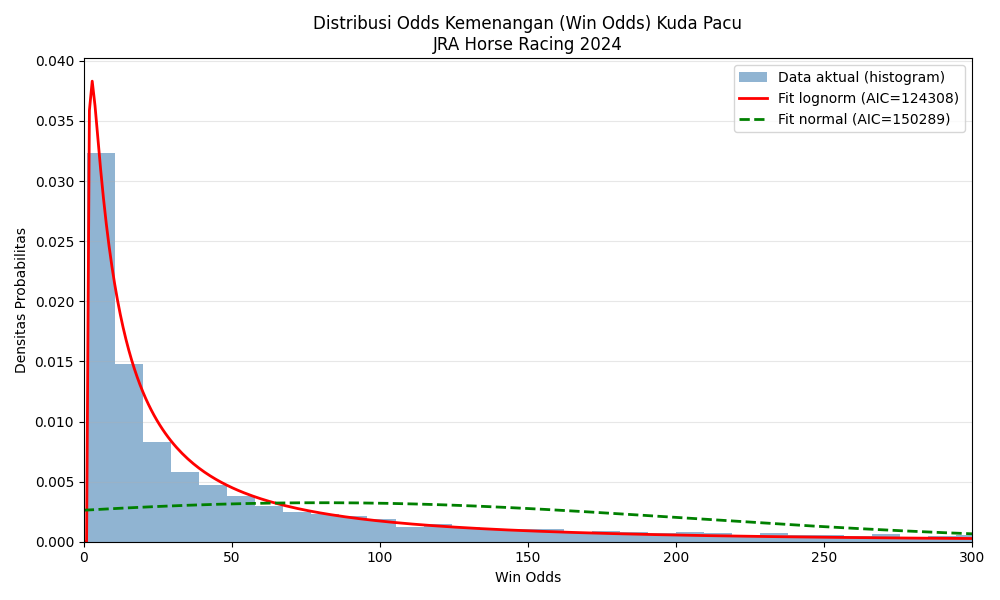
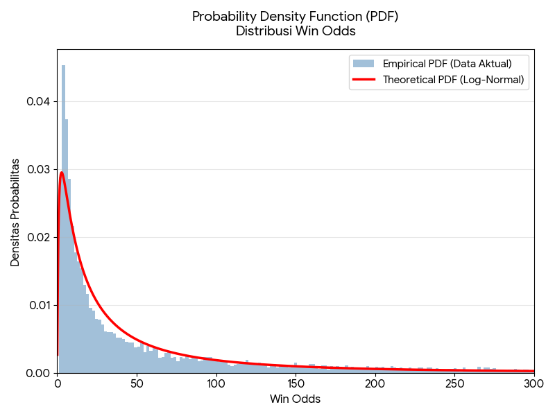
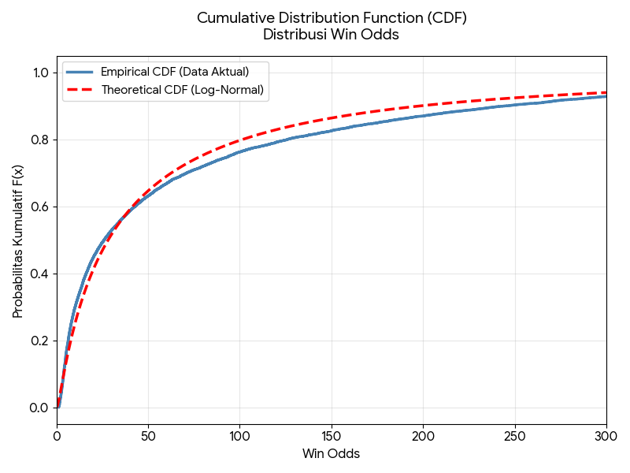

# JRA 2024 Horse Racing - Win Odds Distribution Analysis

Proyek ini bertujuan untuk menganalisis dan memvalidasi bentuk distribusi probabilitas dari variabel kontinu **Odds Kemenangan (`win_odds`)** menggunakan dataset hasil pacuan kuda *Japan Racing Association* (JRA) tahun 2024.

---

## 📌 Deskripsi Data & Parameter Statistik

* **Sumber Data:** Dataset Pacuan Kuda JRA 2024 (Kaggle)
* **Variabel Utilitas:** `win_odds`

Berikut adalah ringkasan parameter statistik aktual untuk data *Win Odds*:
* **μ (Rata-rata) = 80,34**: Patokan nilai pusat secara matematis. Besarnya angka ini didorong oleh *outlier* ekstrem (kuda yang sangat tidak diunggulkan), mengingat mayoritas data sebenarnya menumpuk di odds yang jauh lebih kecil (median 26,10).
* **σ (Standar Deviasi) = 122,96**: Tingkat keragaman nilai odds. Nilai yang sangat besar menunjukkan variasi peluang kemenangan yang sangat ekstrem dan fluktuatif antar kuda.
* **σ² (Varians) = 15.118,39**: Ukuran sebaran data di sekitar rata-rata. Menegaskan bahwa sebaran data sangat berpencar dan memiliki ekor yang merentang sangat jauh dari titik pusatnya.
* **[a, b] (Batas Data) = [1,1 ; 948,5]**: Rentang nilai rasio imbal hasil (*Win Odds*) yang tercatat secara nyata. Batas bawah 1,1 menandakan kuda yang paling difavoritkan, sedangkan 948,5 adalah kuda *underdog* ekstrem.
* **N (Total Data) = 12.060**: Banyaknya catatan observasi valid yang digunakan dalam analisis (setelah *missing values* dikeluarkan).

---

## 📊 Hasil Uji Distribution Fitting (AIC)

Pengujian dilakukan terhadap 5 kandidat distribusi probabilitas. Model dievaluasi menggunakan kriteria **Akaike Information Criterion (AIC)**:

| Distribusi | Nilai AIC | Evaluasi Kecocokan Relatif |
| :--- | :--- | :--- |
| **Log-Normal** | **124.308** | **Best Fit (Relatif Terbaik)** |
| Gamma | 125.589 | Cocok |
| Weibull | 125.834 | Cukup Cocok |
| Exponential | 129.588 | Kurang Cocok |
| Normal | 150.289 | Paling Tidak Cocok |

> **Kesimpulan Utama:** Distribusi **Log-Normal** terbukti secara matematis merupakan model relatif terbaik dibanding kandidat lainnya karena memiliki nilai AIC paling rendah dengan keunggulan yang signifikan ($\Delta\text{AIC} > 10$).

---

## 🖼️ Visualisasi & Pemodelan Data

### 1. Visualisasi Awal: Komparasi Distribusi
Grafik di bawah ini membandingkan data aktual (histogram) dengan kecocokan kurva **Log-Normal** (merah) dan **Normal** (hijau). Terlihat jelas bahwa distribusi Normal memaksakan simetrisitas dan gagal menangkap ekor data, sementara Log-Normal sangat presisi mengikuti pola *right-skewed*.


### 2. Pemodelan Log-Normal (Best Fit)
Karena Log-Normal terpilih sebagai *best fit*, berikut adalah pemodelan fungsi probabilitas spesifiknya dengan parameter turunan $\mu = 3,3420$ dan $\sigma = 1,5204$.

#### Probability Density Function (PDF)
Fungsi kepadatan probabilitas (PDF) ini menunjukkan seberapa sering nilai odds tertentu muncul. 
$$f(x) = \frac{1}{x\sigma\sqrt{2\pi}} \exp\left(-\frac{(\ln x - \mu)^2}{2\sigma^2}\right)$$


#### Cumulative Distribution Function (CDF)
Fungsi distribusi kumulatif (CDF) ini menunjukkan probabilitas bahwa nilai *win_odds* akan kurang dari atau sama dengan suatu *threshold*. Sangat berguna untuk analisis persentil (misal: probabilitas $80\%$ populasi berada di bawah odds $120$).
$$F(x) = \Phi\left(\frac{\ln x - \mu}{\sigma}\right)$$


---

## 🔍 Evaluasi Metodologi & Batasan Analisis (*Critical Review*)

1. **Provenans Data (Data Provenance):** Data berasal dari agregasi pihak ketiga (Kaggle), bukan API resmi JRA. Validitas bergantung pada kurasi *uploader*.
2. **Karakteristik Uji Kolmogorov-Smirnov (KS-Test):** Meskipun Log-Normal unggul secara relatif (AIC), uji KS memberikan p-value $< 0,05$ (menolak $H_0$ absolut). Hal ini dikarenakan pada ukuran sampel besar ($n > 12.000$), uji KS memiliki *power* yang sangat tinggi sehingga deviasi kecil dari distribusi teoritis akan terdeteksi signifikan. Oleh karena itu, kriteria AIC lebih tepat digunakan untuk perbandingan relatif antar-model.
3. **Penanganan Outlier & Pembatasan Visual:** Sumbu-X pada grafik dibatasi hingga batas `300` agar visualisasi kurva utama tetap terfokus. Terdapat sekitar **7,2% data ($> 300$)** yang berada pada ekor panjang (*long-tail*) dan terpotong secara visual, namun seluruh data penuh tetap disertakan dalam perhitungan kriteria AIC dan parameter model.

---

## 🛠️ Cara Menjalankan Kode

1. Pastikan Python 3.x dan *library* yang dibutuhkan sudah terinstal:
   ```bash
   pip install pandas numpy matplotlib scipy